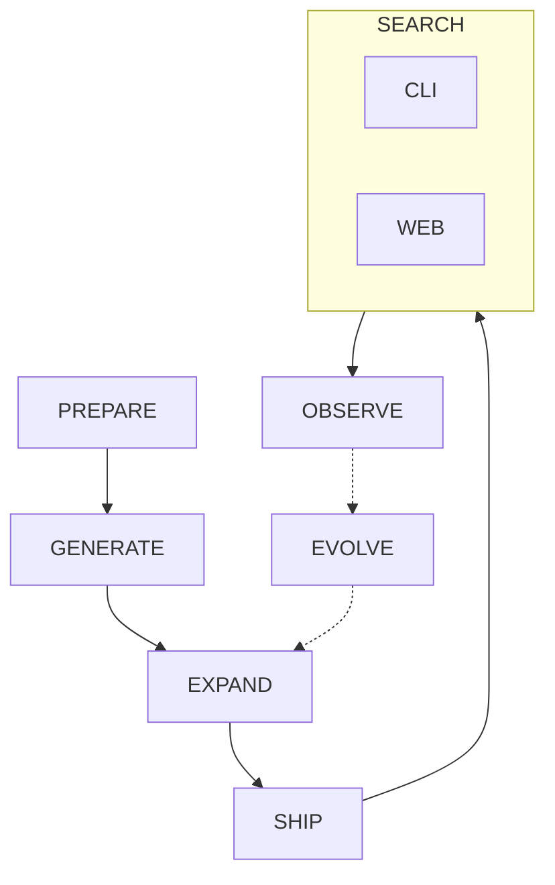
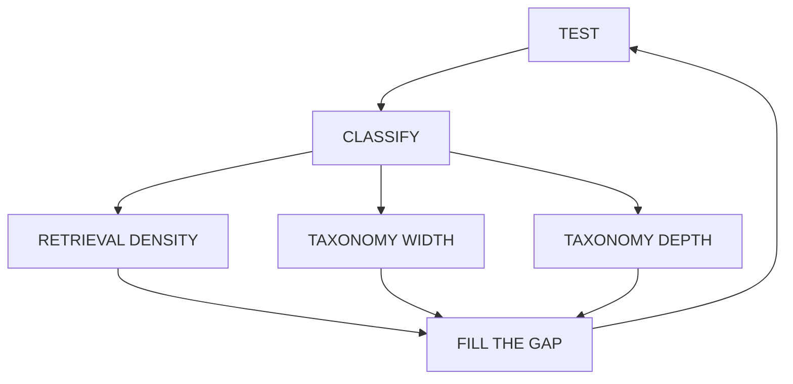

# git-grasp

[](LICENSE)
[](https://bun.sh)
[](https://www.npmjs.com/package/git-grasp)
[](https://git-grasp.cremaschi.dev)
[](docs/SEARCH.md)
[](https://git-grasp.cremaschi.dev)

**git-grasp** turns “how do I … in Git?” into a short, trusted recipe — offline, on your machine.

Natural-language search over a finite catalog of validated Git recipes. Embeddings and FTS run locally. The tool **never executes Git for you**, needs **no API key to search**, and ships the same catalog to the **CLI** and the **web playground**.

## Philosophy

The catalog is **LLM-built** from `git help` and a goal taxonomy. Product search never calls an LLM. Real usage (opt-in) is meant to feed the next catalog version.



**EXPAND** loops until hard questions stay green:



| Stage | Meaning |
|-------|---------|
| [PREPARE](docs/ARCHITECTURE.md#prepare) | Decide what Git can do and how user goals should be organized around it. |
| [GENERATE](docs/ARCHITECTURE.md#generate) | Invent recipes for each goal and keep only those that hold up under checks. |
| [EXPAND](docs/ARCHITECTURE.md#expand) | Test hard questions, classify misses, fill gaps (density / width / depth), retest until strong. |
| [SHIP](docs/ARCHITECTURE.md#ship) | Freeze a trusted catalog so every user gets the same offline answers. |
| [SEARCH](docs/SEARCH.md) | Ask in plain language — install the CLI or use the web playground. |
| [OBSERVE](docs/OBSERVE.md) | Optionally notice how people actually ask (privacy-first, off by default). |
| [EVOLVE](docs/ARCHITECTURE.md#evolve) | Turn real usage into the next better catalog (PostHog pull → feeder → EXPAND). |

Catalog operator runbook: [`apps/pipeline/src/README.md`](apps/pipeline/src/README.md). Decisions: [docs/ARCHITECTURE.md](docs/ARCHITECTURE.md).

## Performance

> **Historical only** — published latency figures are from a pre–schema-v9 catalog (intents-era). Re-bench on the current description-KNN catalog before citing product numbers.

Protocol and targets: [benchmarks/README.md](benchmarks/README.md). Snapshot archive: [benchmarks/latest.md](benchmarks/latest.md).

## Project structure

```text
git-grasp/
├── apps/
│   ├── cli/           # Bun CLI — apps/cli/README.md
│   ├── pipeline/      # Catalog Anvil script
│   │   └── src/       # index.ts, commons/, steps/, tests/, README.md
│   └── web/           # Site + playground — apps/web/README.md
├── common/            # Shared library, shipped data/ + config/
├── benchmarks/        # Performance protocol + latency archive
├── docs/              # Philosophy and architectural decisions
├── test/              # Unit, integration, performance
└── .github/           # CI and release workflows
```

## Install

Requires **Bun ≥ 1.1**.

### Bun (npm registry)

```bash
bun add -g git-grasp
git-grasp "undo last commit but keep my files"
```

From a clone:

```bash
bun install
bun run ship
bun link
```

### Binaries (latest GitHub Release)

| Platform | Download |
|----------|----------|
| Linux x64 | https://github.com/NuclearManatee/git-grasp/releases/latest/download/git-grasp-linux-x64.zip |
| macOS Apple Silicon | https://github.com/NuclearManatee/git-grasp/releases/latest/download/git-grasp-darwin-arm64.zip |
| macOS Intel | https://github.com/NuclearManatee/git-grasp/releases/latest/download/git-grasp-darwin-x64.zip |
| Windows x64 | https://github.com/NuclearManatee/git-grasp/releases/latest/download/git-grasp-windows-x64.zip |

1. **Unzip** the asset for your OS (keep the folder layout intact).
2. Keep **`common/`** beside the binary (`git-grasp` or Windows **`git-grasp.exe`**).
3. Run from the extracted folder: `./git-grasp "…"` / `.\git-grasp.exe "…"`.
4. Optional: set **`GIT_GRASP_ROOT`** to that folder if you move the binary.

Checksums: `SHA256SUMS` on each GitHub Release. Building: [docs/BUILDING-BINARIES.md](docs/BUILDING-BINARIES.md).

Prefer not to install? Use the [web playground](https://git-grasp.cremaschi.dev).

## Usage

```bash
git-grasp "undo last commit but keep my files"
git-grasp search "create a branch" --verbose
git-grasp --json "stash my changes"
git-grasp doctor
git-grasp init
git-grasp --version
```

- **`--verbose`** / **`--copy`** / **`--json`** / **`--quiet`** — search output controls.
- Offline after install + seed (embedding model downloads on first real search, or run `init`).
- Optional: `git-grasp telemetry on|off|status` · `git-grasp update-check on|off|status` (both **off** by default).

Full command reference, exit codes, env vars, and completions: [apps/cli/README.md](apps/cli/README.md).

### Telemetry (optional)

Off by default. Soft invite on first interactive search. Hard off: `DO_NOT_TRACK=1` or `GIT_GRASP_TELEMETRY=0`.

```bash
git-grasp telemetry on|off|status
```

Details: [docs/OBSERVE.md](docs/OBSERVE.md), [Privacy](https://git-grasp.cremaschi.dev/privacy).

### Further reading

| Topic | Where |
|-------|-------|
| Catalog pipeline (run) | [apps/pipeline/src/README.md](apps/pipeline/src/README.md) |
| Web playground (run) | [apps/web/README.md](apps/web/README.md) |
| CLI reference | [apps/cli/README.md](apps/cli/README.md) |
| Architecture | [docs/ARCHITECTURE.md](docs/ARCHITECTURE.md) |
| Search algorithm | [docs/SEARCH.md](docs/SEARCH.md) |

### Contributor scripts

| Script | Role |
|--------|------|
| `bun run cli` / `doctor` | CLI entry / health |
| `bun run typecheck` | `tsc --noEmit` |
| `bun run ci` | Local CI (typecheck → unit/integration → audit; mock embeddings) |
| `bun test` / `test:unit` / `test:integration` | Bun test (unit + integration + pipeline) |
| `bun run test:telemetry-e2e` / `test:evolve-e2e` | Optional local Docker PostHog e2e (skips if `:8010` is down) |
| `bun run bench` / `bench:install` / `bench:render-latest` | Perf harnesses + commit snapshot |
| `bun run build:cli` / `build:release` | Compile CLI / release zip |

Pipeline and web scripts live in those READMEs. CI workflows: [.github/README.md](.github/README.md).
