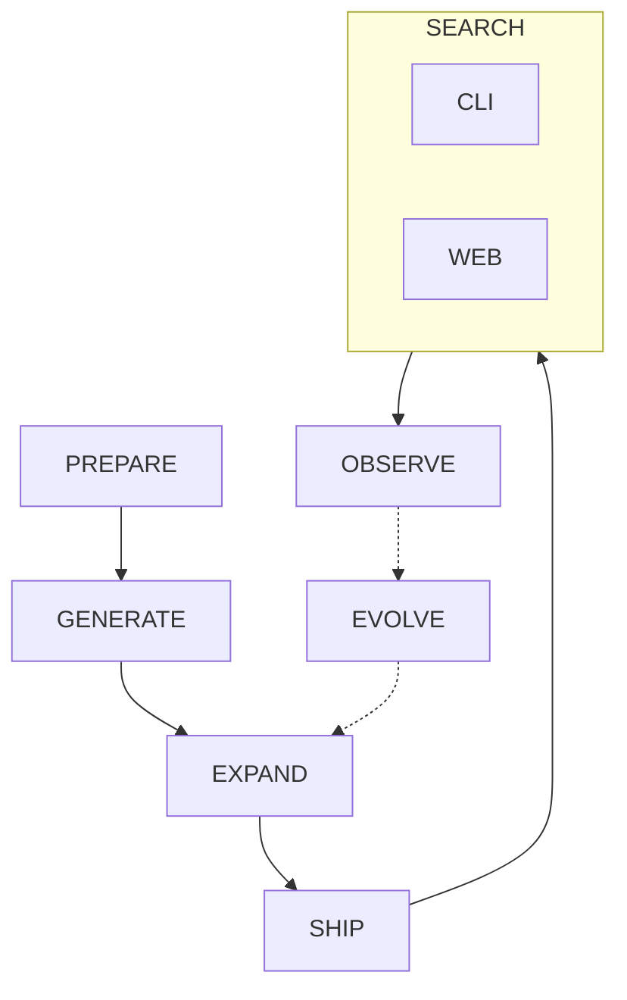
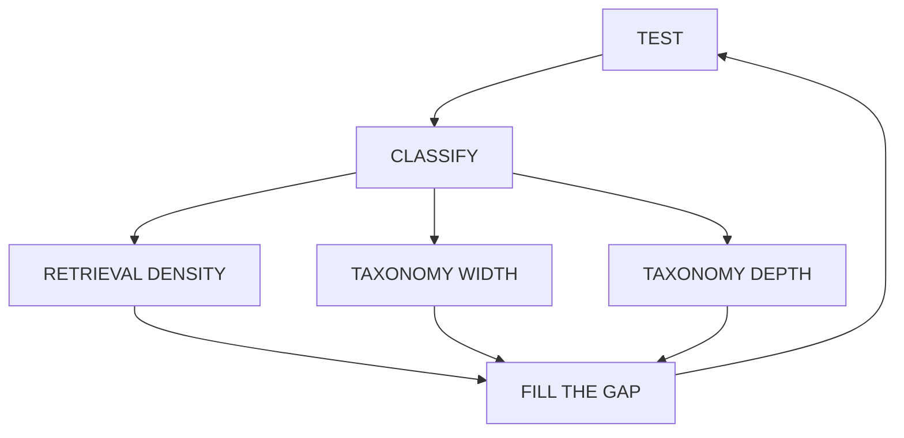

# git-grasp

[](LICENSE)
[](https://bun.sh)
[](https://www.npmjs.com/package/git-grasp)
[](https://git-grasp.cremaschi.dev)
[](docs/search.md)
[](https://git-grasp.cremaschi.dev)

**git-grasp** turns “how do I … in Git?” into a short, trusted recipe — offline, on your machine.

Natural-language search over a finite catalog of validated Git recipes. Embeddings and FTS run locally. The tool **never executes Git for you**, needs **no API key to search**, and ships the same catalog to the **CLI** and the **web playground**.

## Philosophy

The catalog is **LLM-built** from `git help` and a goal taxonomy. Product search never calls an LLM. Real usage (opt-in) is meant to feed the next catalog version.



**EXPAND** loops until hard questions stay green:



| Stage | Meaning |
|-------|---------|
| [PREPARE](docs/prepare.md) | Decide what Git can do and how user goals should be organized around it. |
| [GENERATE](docs/generate.md) | Invent recipes for each goal and keep only those that hold up under checks. |
| [EXPAND](docs/expand.md) | Test hard questions, classify misses, fill gaps (density / width / depth), retest until strong. |
| [SHIP](docs/ship.md) | Freeze a trusted catalog so every user gets the same offline answers. |
| [SEARCH](docs/search.md) | Ask in plain language — install the CLI or use the web playground. |
| [OBSERVE](docs/observe.md) | Optionally notice how people actually ask (privacy-first, off by default). |
| [EVOLVE](docs/evolve.md) | Turn real usage into the next better catalog (Umami pull → feeder → EXPAND). |

Stage details: [docs/pipeline.md](docs/pipeline.md).

## Performance

> **Under construction** — numbers and methodology are being refreshed.

Sub-second retrieval on a low-end laptop (Docker 2 vCPU / 4GB). Latest numbers: [docs/benchmarks/latest.md](docs/benchmarks/latest.md). Protocol: [docs/perf.md](docs/perf.md).

## Project structure

```text
git-grasp/
├── apps/
│   ├── cli/           # Bun CLI
│   ├── pipeline/      # Catalog batch jobs
│   │   └── src/
│   │       ├── prepare/   # scrape git help, build goal taxonomy
│   │       ├── generate/  # ground leaves (generate → validate → saturate)
│   │       ├── expand/    # held-out, triage, regression loop
│   │       ├── evolve/    # OBSERVE pull → feeder → EXPAND chain
│   │       ├── ship/      # version corpus, seed product DB
│   │       └── eval/      # eval harnesses
│   └── web/           # Landing with in-browser playground
├── common/            # Shared code
├── docs/              # Philosophy, Architecture, Specs, Performance benchmarks, Security Assessments
├── test/              # Unit, Integration, Performance tests
└── .github/           # CI and release workflows
```

## Install

Requires **Bun ≥ 1.1**.

### Bun (npm registry)

```bash
bun add -g git-grasp
git-grasp "undo last commit but keep my files"
```

From a clone:

```bash
bun install
bun run ship    # or: bun run seed
bun link
```

### Binaries (latest GitHub Release)

| Platform | Download |
|----------|----------|
| Linux x64 | https://github.com/cremaschi/git-grasp/releases/latest/download/git-grasp-linux-x64.zip |
| macOS Apple Silicon | https://github.com/cremaschi/git-grasp/releases/latest/download/git-grasp-darwin-arm64.zip |
| macOS Intel | https://github.com/cremaschi/git-grasp/releases/latest/download/git-grasp-darwin-x64.zip |
| Windows x64 | https://github.com/cremaschi/git-grasp/releases/latest/download/git-grasp-windows-x64.zip |

1. **Unzip** the asset for your OS (keep the folder layout intact).
2. Keep **`common/`** beside the binary (`git-grasp` or Windows **`git-grasp.exe`**).
3. Run from the extracted folder: `./git-grasp "…"` / `.\git-grasp.exe "…"`.
4. Optional: set **`GIT_GRASP_ROOT`** to that folder if you move the binary.

Checksums: `SHA256SUMS` on each GitHub Release. Building: [docs/building-binaries.md](docs/building-binaries.md).

Prefer not to install? Use the [web playground](https://git-grasp.cremaschi.dev).

## Usage

```bash
git-grasp "undo last commit but keep my files"
git-grasp search "create a branch" --verbose
git-grasp --json "stash my changes"
git-grasp doctor
git-grasp init
git-grasp --version
```

- **`--verbose`** / **`--copy`** / **`--json`** / **`--quiet`** — search output controls.
- Offline after install + seed (embedding model downloads on first real search, or run `init`).
- Optional: `git-grasp telemetry on|off|status` · `git-grasp update-check on|off|status` (both **off** by default).

Full command reference, exit codes, env vars, and completions: [docs/cli.md](docs/cli.md).

### Telemetry (optional)

Off by default. Soft invite on first interactive search. Hard off: `DO_NOT_TRACK=1` or `GIT_GRASP_TELEMETRY=0`.

```bash
git-grasp telemetry on|off|status
```

Details: [docs/observe.md](docs/observe.md), [Privacy](https://git-grasp.cremaschi.dev/privacy).

### Further reading

| Topic | Doc |
|-------|-----|
| CLI (full reference) | [docs/cli.md](docs/cli.md) |
| CLI UX copy & chalk (V1 chalk-only) | [docs/cli-ux.md](docs/cli-ux.md) |
| Web playground | [docs/web.md](docs/web.md) |
| Search algorithm | [docs/search.md](docs/search.md) |
| Maintainer scripts | [docs/maintainer.md](docs/maintainer.md) |
| Architecture | [docs/architecture.md](docs/architecture.md) |
| Git flow | [docs/git-flow.md](docs/git-flow.md) |
| CI secrets | [docs/ci.md](docs/ci.md) |
| Security | [docs/security.md](docs/security.md) |
