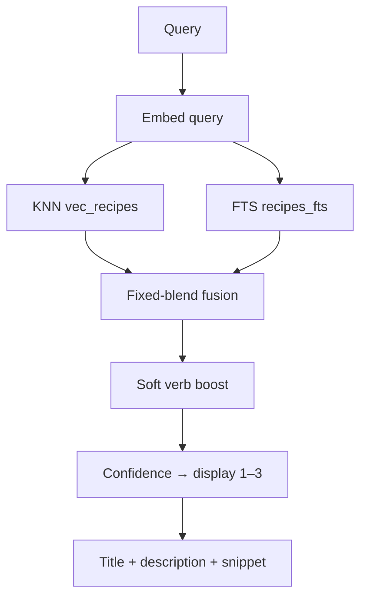

# CLI (`apps/cli`)

## CLI reference

Local Bun CLI for semantic Git-recipe search. Never executes Git for the user.

Lifecycle: **SEARCH** ([Search](#search)) + **OBSERVE** ([OBSERVE](../../docs/OBSERVE.md)).

Short “common path” examples live in the root [README Usage](../README.md#usage). This page is the full reference. Copy and chalk styling: [UX](#ux). The [web playground](../apps/web/README.md) mirrors search chrome (`formatSearchResult`) and shows `MSG.telemetry.on` on Start; full command surface (doctor, update-check, completion, …) remains CLI-only.

## Install

Requires **Bun ≥ 1.1**.

```bash
bun add -g git-grasp
# or from a clone:
bun install && bun run ship && bun link
```

Release binaries: [BUILDING-BINARIES](../../docs/BUILDING-BINARIES.md). Package root resolution: `GIT_GRASP_ROOT`, or the directory containing `common/data` + `common/config/thresholds.json` (compiled binary dir / cwd / walk-up).

## Commands

| Command | Purpose |
|---------|---------|
| `git-grasp "<query>"` | Default search (fast path) |
| `git-grasp search [query…]` | Same search via Commander |
| `git-grasp doctor` | Diagnose DB, model, sqlite-vec, config |
| `git-grasp init` | Doctor checks + warm embedding model |
| `git-grasp config show\|path` | Print resolved config JSON or file path |
| `git-grasp telemetry on\|off\|status` | Opt-in cookieless analytics (default off) |
| `git-grasp update-check on\|off\|status` | Opt-in npm update notices (default off) |
| `git-grasp set-level <level>` | **Deprecated/parked** — stores skill preference; **no retrieval effect in schema v9** |
| `git-grasp completion <shell>` | Print completion script (`bash\|zsh\|fish\|powershell`) |
| `git-grasp help` | Help |
| `git-grasp -V` / `--version` | App + catalog identity |

## Search flags

| Flag | Meaning |
|------|---------|
| `-v, --verbose` | Confidence / channel scores |
| `-c, --copy` | Copy winning example to clipboard |
| `--json` | Machine-readable JSON on stdout only |
| `-q, --quiet` | No spinner; skip telemetry invite |
| `-h, --help` | Help |
| `-V, --version` | Version report |

**stdin:** if there is no query argument and stdin is not a TTY, the piped text is used as the query.

```bash
echo "undo last commit keep files" | git-grasp
git-grasp --json "create a branch"
```

## Version identity

`--version` / doctor print:

```text
git-grasp 0.1.0
catalog v5 (941 recipes) · schema v9 · db abcdef012345
```

Catalog version comes from `common/data/catalog/recipes.latest.json` (also stamped into DB meta as `corpus_version` on seed).

## Config

File: platform user config dir (`%APPDATA%/git-grasp/config.json` on Windows; `~/.config/git-grasp/config.json` on Linux/macOS). Mode/ACL tightened on write.

| Field | Default | Meaning |
|-------|---------|---------|
| `schemaVersion` | `4` | Config schema |
| `skillLevel` | `null` | Parked preference (no retrieval effect in v9) |
| `telemetry` | `null` | `true` / `false` / unset |
| `telemetryInvite` | `pending` | Soft invite state |
| `updateCheck` | `null` | `true` enables npm ping |

```bash
git-grasp config show
git-grasp config path
```

## Update check (npm)

Opt-in. When enabled, after a successful search (and on `doctor` / `update-check status`) the CLI may GET `https://registry.npmjs.org/git-grasp/latest` (≈2.5s timeout). Results cache 24h under the user cache dir (`update-check.json`). Failures are silent. Hard off: `GIT_GRASP_UPDATE_CHECK=0`.

When a newer release is found, a **yellow** notice is printed on stderr (whole line, including the install command).

```bash
git-grasp update-check on
git-grasp update-check status
```

## Help

Bare `git-grasp` / `--help` opens with a short Common commands block (search, doctor, init, config, telemetry, update-check, completion). Voice and chalk rules: [UX](#ux). **V1 product output is chalk-only** (no emoji unless `GIT_GRASP_EMOJI=1`).

## Completions

```bash
eval "$(git-grasp completion bash)"
# zsh: eval "$(git-grasp completion zsh)"
# fish: git-grasp completion fish > ~/.config/fish/completions/git-grasp.fish
# PowerShell: git-grasp completion powershell | Out-String | Invoke-Expression
```

## Exit codes

| Code | Meaning |
|------|---------|
| `0` | Success |
| `1` | Generic error |
| `2` | DB integrity / schema version mismatch (`INTEGRITY` / `VERSION`) |
| `3` | Config error (`CONFIG` / `CONFIG_INSECURE`) |
| `5` | Catalog/search version mismatch when distinguished from integrity (`VERSION`) |

`--json` search mode skips telemetry invite/track (see [OBSERVE](../../docs/OBSERVE.md)).

## Environment

| Variable | Role |
|----------|------|
| `GIT_GRASP_ROOT` | Force package root |
| `GIT_GRASP_MOCK_EMBEDDINGS=1` | Deterministic mock embeddings |
| `GIT_GRASP_TELEMETRY=0` / `DO_NOT_TRACK=1` | Hard-off telemetry (refuse enable + no-op send) |
| `GIT_GRASP_UPDATE_CHECK=0` | Hard-off npm update check |
| `GIT_GRASP_INSTALL=binary\|bun` | Hint for update-notice install copy |
| `GIT_GRASP_BENCH=1` | Print search phase timings on stderr |
| `NO_COLOR` | Disable chalk colors when set |
| `GIT_GRASP_EMOJI=1` | Opt-in closed-set emoji glyphs (off by default in V1) |
| `GIT_GRASP_NO_EMOJI=1` | Hard-off emoji even if `GIT_GRASP_EMOJI=1` |
| `GIT_GRASP_POSTHOG_HOST` / `GIT_GRASP_POSTHOG_KEY` | Override baked PostHog EU ingest defaults (empty key disables send). Docker e2e uses `http://127.0.0.1:8010` |

## Runtime notes

- Depends on `@git-grasp/common/cli`.
- Offline after install + seed; embedding model downloads on first real search (or `init`).
- Telemetry: [OBSERVE](../../docs/OBSERVE.md). Search algorithm: [Search](#search).

```bash
bun run cli -- "undo last commit but keep my files"
bun run doctor
bun run build:release
```

---
# CLI UX copy & style

Living **design** spec for product-facing CLI text and chalk styling (and optional emoji).  
Synced with `common/src/ux/cliStyle.ts` and the CLI apps.

Command reference: [CLI reference](#cli-reference).

**V1 ships chalk-only.** The closed emoji set below is documented for an opt-in preview (`GIT_GRASP_EMOJI=1`); product default output has **no** emoji glyphs.

---

## Principles

1. **One job per line** — status first, explanation second, link/action last.
2. **Prefer “is …”** for toggles (`Telemetry is enabled.` not `Telemetry enabled`).
3. **Never scare without a next step** — every error/warn suggests what to do.
4. **`--json` / pipe** — plain JSON on stdout; no color chrome on structured output. Status chrome on stderr only when useful.
5. **Respect `NO_COLOR`** — chalk no-ops. Emoji only when `GIT_GRASP_EMOJI=1` (and not hard-off via `GIT_GRASP_NO_EMOJI=1`).
6. **Doctor stays dense** — diagnostics for maintainers; status glyph after the label (`DB: OK` / `DB: ✅`).
7. **Emoji sparingly (opt-in)** — only the closed set; never inside git snippets. V1 default: omitted.

---

## Locked decisions

| Topic | Decision |
|-------|----------|
| Privacy URL | Always `link` (cyan underline) |
| Update notice | Entire line `warn` (yellow), including install command |
| Telemetry off | Muted (`info` / dim) |
| Doctor status | Label first, status last: `DB: OK` (V1) / `DB: ✅` (emoji mode) |
| High-risk | `caution` (orange) |
| Hard errors (exit 2/3) | Append tip to run `git-grasp doctor` |
| Emoji in V1 | Off by default; opt-in `GIT_GRASP_EMOJI=1` |
| Help Common commands | Include `config` and `completion` |

---

## Emoji set (closed, opt-in)

Pick is intentional and small. Do not invent new ones without updating this table. **V1: omitted unless `GIT_GRASP_EMOJI=1`.**

| Emoji | Token | Meaning | Typical chalk |
|-------|-------|---------|---------------|
| ✅ | `emoji.ok` | Success, enabled, healthy, up to date | `ok` / `okMark` |
| ⚠️ | `emoji.warn` | Caution: multi-match, update, clipboard fail, high-risk | `warn` / `caution` |
| ❌ | `emoji.error` | Failure, empty search, usage error, doctor FAIL | `error` / `failMark` |
| ℹ️ | `emoji.info` | Neutral status, invite, warming/progress | `muted` / `info` |

**Not in the set:** 🎉 🔥 💡 🚀 ✨ 👍.

**Placement (emoji mode):** `{emoji} {sentence}` for confirmations; doctor uses glyph **after** the label (`DB: ✅`).

**Env:**

| Variable | Effect |
|----------|--------|
| (default) | No emoji |
| `GIT_GRASP_EMOJI=1` | Enable closed-set glyphs |
| `GIT_GRASP_NO_EMOJI=1` | Hard-off (wins over `GIT_GRASP_EMOJI`) |

---

## Color tokens

Named roles → chalk. Mirror in `common/src/ux/cliStyle.ts`.

| Token | Chalk | Use |
|-------|-------|-----|
| `brand` | `bold` | Product name in version line |
| `command` | `cyan` | Git snippets (search hits); not used inside whole-line update warn |
| `title` | `bold` | Recipe title / primary hit line |
| `ok` | `green` | Success body |
| `label` | `bold` | Short labels (`Telemetry:`) |
| `muted` | `dim` | Secondary detail, telemetry off, verbose scores |
| `info` | default | Neutral body |
| `link` | `cyan.underline` | Privacy and other URLs |
| `warn` | `yellow` | Soft caution, update available (whole line) |
| `caution` | `hex('#FF8C00')` | Uncertain match, high-risk |
| `error` | `red` | Failures, empty search, usage errors |
| `okMark` / `failMark` | green / red.bold | Doctor `OK` / `FAIL` / `MISSING` (V1) |

---

## Nielsen heuristic review

Review of the CLI surface against [Nielsen’s 10 heuristics](https://www.nngroup.com/articles/ten-usability-heuristics/).  
Grades: **Good** / **Mixed** / **Gap**. Spec actions reflect the locked V1 design (chalk-only; emoji optional).

### 1. Visibility of system status — Mixed


| Evidence                                      | Spec action                                                    |
| --------------------------------------------- | -------------------------------------------------------------- |
| Spinner while searching; doctor/init progress | Keep. Warm line uses muted/info styling                        |
| Telemetry/update-check status commands        | `Label: on|off` with chalk; emoji only if opt-in               |
| Silent npm check failures                     | OK (privacy); status shows `(unreachable)`                     |
| First model download can feel “stuck”         | Clearer spinner / status text from embedder                    |


### 2. Match between system and the real world — Good → tighten


| Evidence                                    | Spec action                                                |
| ------------------------------------------- | ---------------------------------------------------------- |
| Natural-language query as default           | Keep                                                       |
| “Telemetry / update check / catalog” jargon | Prefer plain words in user copy; keep command names stable |
| Skill “parked” language                     | Say “does not change search results yet”                   |


### 3. User control and freedom — Good


| Evidence                                            | Spec action                                             |
| --------------------------------------------------- | ------------------------------------------------------- |
| Telemetry & update-check off by default; easy `off` | Keep; confirm with ✅/ℹ️                                 |
| Invite `d` = don’t ask again                        | Keep in invite copy                                     |
| Never auto-runs git                                 | Keep as product invariant (mention in empty-state tip?) |


### 4. Consistency and standards — Mixed


| Evidence                                                      | Spec action                                                                                 |
| ------------------------------------------------------------- | ------------------------------------------------------------------------------------------- |
| Toggle voice (“is enabled/disabled”)                          | Apply to all toggles + emoji                                                                |
| Status heads were inconsistent (`telemetry:` vs `Telemetry:`) | Always `Label: on|off` + emoji                                                              |
| Exit codes exist but are invisible in UI                      | On hard errors, optional last line: `ℹ️ Exit code 2 — see git-grasp doctor` (open question) |


### 5. Error prevention — Mixed


| Evidence                                           | Spec action                                                    |
| -------------------------------------------------- | -------------------------------------------------------------- |
| Never executes recipes                             | Strong                                                         |
| High-risk + multi-match warnings                   | Prefix ⚠️; keep “verify before running”                        |
| `set-level` still exists but is a no-op for search | Help text must say so; consider hiding from default help later |
| Empty query → help                                 | Keep                                                           |


### 6. Recognition rather than recall — Mixed / Gap


| Evidence                                         | Spec action                                         |
| ------------------------------------------------ | --------------------------------------------------- |
| Bare `git-grasp` → help                          | Good                                                |
| Completions exist                                | Document install in help footer?                    |
| Users must remember `telemetry` / `update-check` | Help should list common commands in one short block |
| Invite says “Later: …”                           | Keep ℹ️                                             |


### 7. Flexibility and efficiency of use — Good


| Evidence                                         | Spec action                                       |
| ------------------------------------------------ | ------------------------------------------------- |
| Fast path query, `--json`, `--copy`, stdin, `-q` | Keep; no emoji on `--json` stdout                 |
| Expert env hard-offs                             | Keep undocumented-in-help is fine; live in [CLI reference](#cli-reference) |


### 8. Aesthetic and minimalist design — Mixed (emoji policy)


| Evidence                | Spec action                                              |
| ----------------------- | -------------------------------------------------------- |
| Dense search hit layout | Keep; emoji only on alert/risk lines, not on every title |
| Doctor walls of text    | ✅/❌ on status only                                       |
| Closed emoji set        | Enforced above — prevents decoration creep               |


### 9. Help users recognize, diagnose, recover from errors — Mixed


| Evidence                                     | Spec action                                             |
| -------------------------------------------- | ------------------------------------------------------- |
| Colored errors + doctor Fix: lines           | Prefix ❌; keep Fix: as ℹ️ indented                      |
| Empty search points to rephrase / `git help` | Prefix ❌                                                |
| Integrity/config failures are code-ish       | Prefer one human sentence + ℹ️ tip (`git-grasp doctor`) |


### 10. Help and documentation — Mixed / Gap


| Evidence                                 | Spec action                                                             |
| ---------------------------------------- | ----------------------------------------------------------------------- |
| `--help`, README Usage, cli.md, this doc | Link privacy with underline                                             |
| Help text is Commander-default dense     | Add a 4–6 line “Common commands” examples block at top of help (design) |
| No in-CLI “tips” after first run         | Out of scope for now                                                    |


### Heuristic summary


| #   | Heuristic                | Grade |
| --- | ------------------------ | ----- |
| 1   | Visibility of status     | Mixed |
| 2   | Real-world match         | Good  |
| 3   | User control             | Good  |
| 4   | Consistency              | Mixed |
| 5   | Error prevention         | Mixed |
| 6   | Recognition over recall  | Gap   |
| 7   | Flexibility / efficiency | Good  |
| 8   | Minimalist aesthetic     | Mixed |
| 9   | Error recovery           | Mixed |
| 10  | Help & docs              | Gap   |


**Biggest design bets from this review:** (A) closed emoji set for status scanning, (B) short Common-commands block on help, (C) every hard failure offers `doctor` or a concrete next step.

---


## Message inventory

IDs are stable for comments (`re: MSG.telemetry.on`).  
**Stream:** `out` = stdout, `err` = stderr.  
**Emoji column** = leading glyph (empty = none).

### Search result chrome


| ID                        | Stream | Emoji | Style                         | Copy                                                                                                  |
| ------------------------- | ------ | ----- | ----------------------------- | ----------------------------------------------------------------------------------------------------- |
| `MSG.search.title`        | out    | —     | `title`                       | Recipe title / example line                                                                           |
| `MSG.search.snippet`      | out    | —     | `command` (+ `muted` comment) | Indented command lines                                                                                |
| `MSG.search.usageRule`    | out    | —     | `muted`                       | Horizontal rule                                                                                       |
| `MSG.search.usageCmd`     | out    | —     | `command`                     | Usage command                                                                                         |
| `MSG.search.desc`         | out    | —     | `info`                        | Intent / description                                                                                  |
| `MSG.search.alert.yellow` | out    | ⚠️    | `warn`                        | Several plausible matches — verify before running.                                                    |
| `MSG.search.alert.orange` | out    | ⚠️    | `caution`                     | Uncertain match — review alternatives carefully before running.                                       |
| `MSG.search.alert.red`    | out    | ❌     | `error`                       | No confident match. Try rephrasing, or run git help.                                                  |
| `MSG.search.risk`         | out    | ⚠️    | `caution`                     | High-risk recipe ({n}) — review before running.                                                       |
| `MSG.search.verbose`      | out    | —     | `muted`                       | confidence / score line                                                                               |
| `MSG.search.spinner`      | err    | —     | ora                           | Searching…                                                                                            |
| `MSG.search.copy.ok`      | err    | ✅     | `muted`                       | Copied command to clipboard.                                                                          |
| `MSG.search.copy.fail`    | err    | ⚠️    | `warn`                        | Clipboard unavailable — command is printed above.                                                     |
| `MSG.search.update`       | err    | ⚠️    | `warn` + `command` on install | A newer git-grasp is available: {latest} (you have {local}). {bun install hint \| binary release-zip hint} |
| `MSG.search.fail.tip`     | err    | ℹ️    | `muted`                       | Run git-grasp doctor if this keeps happening. *(new — for INTEGRITY/CONFIG)*                          |


### Telemetry


| ID                             | Stream | Emoji   | Style            | Copy                                                                                                    |
| ------------------------------ | ------ | ------- | ---------------- | ------------------------------------------------------------------------------------------------------- |
| `MSG.telemetry.on`             | out    | ✅       | `ok` + `link`    | Telemetry is enabled. Your searches will be used to improve the product for everyone. See {PRIVACY_URL} |
| `MSG.telemetry.off`            | out    | ℹ️      | `muted`          | Telemetry is disabled. No search analytics will be sent.                                                |
| `MSG.telemetry.status.head`    | out    | ✅ or ℹ️ | `label`          | Telemetry: on | off                                                                                     |
| `MSG.telemetry.status.meta`    | out    | —       | `muted`          | indented detail lines                                                                                   |
| `MSG.telemetry.invite.blurb`   | err    | ℹ️      | `info`           | Optional analytics help improve search for everyone (cookieless; off by default).                       |
| `MSG.telemetry.invite.privacy` | err    | —       | `muted` + `link` | Privacy: {PRIVACY_URL}                                                                                  |
| `MSG.telemetry.invite.later`   | err    | —       | `muted`          | Later: git-grasp telemetry on|off|status                                                                |
| `MSG.telemetry.invite.prompt`  | err    | —       | `label`          | Enable telemetry? [y/N/d=don't ask again]                                                               |


### Update check


| ID                           | Stream | Emoji   | Style   | Copy                                                                                |
| ---------------------------- | ------ | ------- | ------- | ----------------------------------------------------------------------------------- |
| `MSG.update.on`              | out    | ✅       | `ok`    | Update check is enabled. git-grasp will occasionally check npm for a newer release. |
| `MSG.update.off`             | out    | ℹ️      | `muted` | Update check is disabled. No version checks will be sent.                           |
| `MSG.update.status.head`     | out    | ✅ or ℹ️ | `label` | Update check: on | off                                                              |
| `MSG.update.status.meta`     | out    | —       | `muted` | local / latest / checkedAt                                                          |
| `MSG.update.status.npmNewer` | out    | ⚠️      | `warn`  | npm latest={v} (newer available)                                                    |
| `MSG.update.status.npmOk`    | out    | ✅       | `ok`    | npm latest={v} (up to date)                                                         |
| `MSG.update.status.npmFail`  | out    | ℹ️      | `muted` | npm latest=(unreachable)                                                            |


### Config / skill / init / version


| ID                  | Stream | Emoji | Style            | Copy                                                                       |
| ------------------- | ------ | ----- | ---------------- | -------------------------------------------------------------------------- |
| `MSG.config.usage`  | err    | ❌     | `error`          | Usage: git-grasp config show|path                                          |
| `MSG.skill.cleared` | out    | ℹ️    | `info` + `muted` | Preferred skill cleared. (Does not change search results yet.)             |
| `MSG.skill.set`     | out    | ℹ️    | same             | Preferred skill set to {name} ({n}). (Does not change search results yet.) |
| `MSG.init.warm`     | out    | ℹ️    | `muted`          | Downloading/warming the embedding model…                                   |
| `MSG.init.warmMock` | out    | ℹ️    | `muted`          | Warming embeddings (mock)…                                                 |
| `MSG.init.ready`    | out    | ✅     | `ok`             | Ready. Search will use the local model and catalog.                        |
| `MSG.version.brand` | out    | —     | `brand`          | git-grasp {semver}                                                         |
| `MSG.version.meta`  | out    | —     | `muted`          | catalog · schema · db                                                      |


### Doctor

| ID | V1 (chalk) | Emoji mode | Pattern |
|----|------------|------------|---------|
| `MSG.doctor.ok` | green `OK` | `✅` after label | `DB: OK …` / `DB: ✅ …` |
| `MSG.doctor.fail` | red `FAIL` / `MISSING` | `❌` after label | `DB: FAIL …` / `DB: ❌ …` |
| `MSG.doctor.fix` | muted | muted + optional info glyph | `  Fix: …` |

```text
DB: OK (7428082e30f0…) schema v9 catalog=v5
  Fix: bun run ship   ← only on failure paths
```

### Generic errors

| ID | Stream | Style | Copy |
|----|--------|-------|------|
| `MSG.error.generic` | err | `error` | {human message} |
| `MSG.error.usage.*` | err | `error` | Usage: git-grasp … |
| `MSG.search.fail.tip` | err | `muted` | Run git-grasp doctor if this keeps happening. |

### Help

```text
Common commands:
  git-grasp "undo last commit keep files"
  git-grasp doctor
  git-grasp init
  git-grasp config show
  git-grasp telemetry status
  git-grasp update-check status
  git-grasp completion bash

Full reference: see [CLI reference](#cli-reference) above
```

No emoji in the help command list.

---

## Layout sketches (V1 chalk-only)

### Search hit + soft alert

```text
git reset --soft HEAD~1
  git reset --soft HEAD~1
  ────────────────────────
Several plausible matches — verify before running.   ← yellow
```

### Empty search

```text
No confident match. Try rephrasing, or run git help.   ← red
```

### Telemetry on

```text
Telemetry is enabled. Your searches will be used to improve the product for everyone. See https://…   ← green + link
```

### Update notice (stderr)

```text
A newer git-grasp is available: 0.2.0 (you have 0.1.0). Update with: bun add -g git-grasp@latest   ← whole line yellow (Bun/npm)
A newer git-grasp is available: 0.2.0 (you have 0.1.0). Download the latest release zip…          ← binary install hint
```

### Doctor excerpt

```text
git-grasp 0.1.0
catalog v5 (941 recipes) · schema v9 · db 7428082e30f0
sqlite-vec: OK …
DB: OK …
Model: MISSING — …
  Fix: run git-grasp init
```

---

## Decisions (resolved)

- [x] Privacy URL: always `link` (underline cyan)
- [x] Update notice: whole line `warn` (including install command)
- [x] Telemetry **off**: muted
- [x] Doctor: status **last** (`DB: OK` / `DB: ✅`)
- [x] High-risk: `caution` (orange)
- [x] On exit code 2/3: append tip to run `git-grasp doctor`
- [x] V1: no emoji by default; opt-in `GIT_GRASP_EMOJI=1` (`GIT_GRASP_NO_EMOJI=1` hard-off)
- [x] Help Common commands: include `config` and `completion`

---

## Reviewer notes

```text
<!-- note: MSG.telemetry.on — … -->
```

---

## Implementation map

| Spec | Code |
|------|------|
| Tokens + emoji helpers | `common/src/ux/cliStyle.ts` |
| Shared MSG formatters | `common/src/ux/messages.ts` |
| Search formatting | `common/src/ux/format.ts` |
| Confirmations / status / help | `apps/cli/src/program.ts` |
| Copy / update notice | `apps/cli/src/runSearch.ts`, `common/src/lib/updateCheck.ts` |
| Invite | `common/src/lib/telemetry/invite.ts` |
| Doctor | `apps/cli/src/doctor.ts` |
| Web playground mirror | `apps/web/src/components/playground/Playground.tsx` — [apps/web/README.md](../apps/web/README.md) |

## Web playground mirror

The marketing playground reuses search formatting and shared MSG helpers:

| MSG / surface | Playground |
|---------------|------------|
| Search alerts / risk / hit layout | Yes — `formatSearchResult` |
| `MSG.telemetry.on` | Printed on successful Start |
| `MSG.init.ready` / warm | Yes |
| `MSG.skill.*` | `set-level` (parked) |
| `MSG.search.copy.*` | `-c` / `--copy` via Clipboard API |
| `telemetry status` | Always **on** after Start |
| Doctor / update-check / completion / invite | CLI-only |

Details and e2e: [apps/web/README.md](../apps/web/README.md).

## Visual review gallery

Generated locally (gitignored under `local/`):

```bash
bun local/cli-ux-review/capture.ts
# then serve local/cli-ux-review on http://127.0.0.1:8765
```

Screenshots: `local/cli-ux-review/screenshots/`.

---
# SEARCH

**Summary:** The product. Ask in plain language — **install the CLI** or use the **web playground**. Same hybrid retrieval either way. **No LLM at query time.**



## Surfaces

| Surface | How |
|---------|-----|
| CLI | `bun add -g git-grasp` or a [release binary](../README.md#binaries-latest-github-release) — full reference [CLI reference](#cli-reference) |
| Web | [git-grasp.cremaschi.dev](https://git-grasp.cremaschi.dev) playground — [apps/web/README.md](../apps/web/README.md) |

## What it does

1. Verify DB `.sha256` integrity, then `schema_version` (**9**) + `search_algorithm_version` (**3**) (CLI and web). Mismatch → `VERSION` (doctor tip).
2. Embed the query (local BGE-small). Recipe embed text is **description + paraphrases**.
3. Parallel description KNN (`vec_recipes`) + BM25 FTS (`recipes_fts`).
4. Fixed-blend fusion (default **α=0.55** cosine / **β=0.45** BM25). Single-channel batches collapse to 1/0 or 0/1.
5. Soft **verb boost** when the query names git verbs (reorders / lifts hybrid scores; also feeds abstain evidence).
6. Confidence-gated display 1–3 (or abstain), then diversify by **structural** command fingerprint (literal vs `<placeholder>` collapse).

## Display gate (honest)

Thresholds live in `common/config/thresholds.json` (`schemaVersion` there is the **thresholds file** version, not DB v9).

| Signal | Behavior |
|--------|----------|
| `confidenceVeryHigh` + exact gap | Show **1**, alert none |
| `confidenceHigh` + narrow gap | Show **2**, alert yellow |
| Below that / near-tie | Show up to **3**, alert orange |
| `confidenceMedium` | Present in config for compatibility — **not** used by the gate |
| Absolute abstain (red / 0) | Only when top cosine is weak **and** no BM25 **and** no verb boost |

Near-ties widen display; crowded ≠ absent. Eval “Hit@display” uses the gated set; leaf held-out also accepts top-10 (see [ARCHITECTURE](../../docs/ARCHITECTURE.md#expand)).

## Code

| Path | Role |
|------|------|
| `apps/cli` | CLI UX |
| `apps/web` | Playground (sql.js pack) |
| `common/src/search/` | Hybrid, fusion, verb boost, embed, FTS |
| `common/src/cli-api.ts` | Shared search facade |

