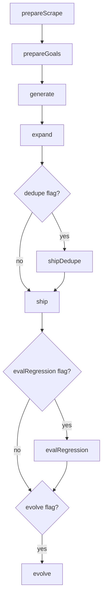

# Catalog pipeline

Operator source of truth for the catalog build script rooted at `apps/pipeline/src`. Implementation stays in `common/src/build/` (and `common/src/evolve/`). SEARCH and OBSERVE are not steps of this script.

`--only=expand --fresh` also runs `generate` then `expand` (legacy `expand --fresh`). `rebuild` is `--from=generate --fresh`. Inner leaf loops (saturate, holdout TEST→CLASSIFY→FILL) stay inside common; checkpoints are per stage.

## Steps

### prepareScrape
- **input:** `git help -a` on this machine
- **output:** `common/taxonomy/git_commands.json`; full probe under `local/prepare/scrape-probe.json`
- **rollback:** `git checkout -- common/taxonomy/git_commands.json`
- **rollbackFn:** yes
- **checkpoint key:** `prepareScrape`
- Probe each listed verb for local availability; strip host-local probe paths from the committed artifact.

### prepareGoals
- **input:** `common/taxonomy/git_commands.json`
- **output:** `common/taxonomy/goal_taxonomy.json`
- **rollback:** `git checkout -- common/taxonomy/goal_taxonomy.json`. LLM token spend is not refundable (`null` for the API call).
- **rollbackFn:** yes (file restore only)
- **checkpoint key:** `prepareGoals`
- LLM brainstorm / decompose / map / reflect. Overwrites an existing taxonomy (`fresh: true`).

### generate
- **input:** `goal_taxonomy.json`
- **output:** `local/cache/build/staging.db` (per-leaf generate → validate → saturate)
- **rollback:** delete `staging.db`. LLM spend is not refundable.
- **rollbackFn:** yes (delete staging)
- **checkpoint key:** `generate`
- Resume skips this step when marked `done`; a failed retry wipes staging via `fresh: true` inside `runGroundStep`.

### expand
- **input:** staging DB + taxonomy; optional `--retry-leaves=<file>`
- **output:** held-out/triage mutations on staging; corpus `recipes.vN.json` when gates pass (corpus version is written here, not in ship)
- **rollback:** git restore `recipes.vN.json` / `regression.json`. LLM spend is not refundable.
- **rollbackFn:** manual-only
- **checkpoint key:** `expand`
- `--retry-leaves` retries listed leaf ids then re-checks regression + leaf-rate before corpus write.

### shipDedupe
- **input:** `common/data/catalog/recipes.json` (or archived v4)
- **output:** next `recipes.vN.json`, rewritten `recipes.json` / `commands.json`
- **rollback:** git restore catalog JSON
- **rollbackFn:** manual-only
- **checkpoint key:** `shipDedupe`
- Conditional: `--dedupe`, or `--only=shipDedupe`. Offline structural merge, no LLM.

### ship
- **input:** catalog `recipes.json`
- **output:** `common/data/git-commands.db` + `.sha256`
- **rollback:** git restore the DB and checksum
- **rollbackFn:** manual-only
- **checkpoint key:** `ship`
- Atomic seed (temp DB → rename). `--mock` / `--mock-embed` for smoke embeddings.

### evalRegression
- **input:** seeded DB + `common/data/eval/regression.json`
- **output:** accuracy summary (no catalog write)
- **rollback:** `null`
- **rollbackFn:** manual-only
- **checkpoint key:** `evalRegression`
- Conditional: `--eval-regression`. CI/release gate; default min accuracy 0.95.

### evolve
- **input:** PostHog pull (`GIT_GRASP_POSTHOG_*`); optional `--no-chain` / `--llm-label` / `--ship`
- **output:** `local/evolve/*` feeder + stats; default chains into EXPAND triage
- **rollback:** restore `local/evolve/cursor.json` from the step snapshot. LLM label spend is not refundable.
- **rollbackFn:** yes (cursor)
- **checkpoint key:** `evolve`
- Conditional: `--evolve` or `--only=evolve`. PostHog pull is read-only.
- Local e2e: `docker compose -f apps/web/docker-compose.posthog.yml --profile e2e up -d`, then `bun run evolve:seed-posthog`. `test:telemetry-e2e` / `test:evolve-e2e` skip if `http://127.0.0.1:8010` is down.

## Requirements

- Bun `1.3.14` (`engines.bun` on `@git-grasp/pipeline`). `.env` is auto-loaded by Bun; do not read it as a file. LLM steps need `DEEPSEEK_API_KEY` in the environment.
- No ngrok / webhooks.
- Non-standard dependencies (via `common/`, authorized for this product catalog): `@huggingface/transformers` (BGE embeddings at generate/ship), `sqlite-vec` (KNN), `mustache` (existing `common/prompts` renderer), `p-limit` (leaf concurrency), `@js-temporal/polyfill` (this script’s timestamps).
- Raw dumps: scrape probe JSON under `local/prepare/` (gitignored). Staging DB under `local/cache/build/`. Run-state SQLite: `local/cache/build/pipeline-state.sqlite`. No `local/raw_data/pipeline/input/` drop is required — live `git help` is the source.
- Resume: re-run the same composition without `--fresh` to skip `done` steps. `--confirm-orphans` if the step list changed. Orphaned rows abort by default.

## Shims

From the repo root (`bun run …`):

| Script | What |
|--------|------|
| `tools:pipeline` | This runner |
| `prepare:scrape` / `prepare:goals` | `--only=prepareScrape` / `prepareGoals` |
| `generate` | `--only=generate` |
| `expand` | `--only=expand` (`--fresh` also runs generate; `--retry-leaves=<file>` retries listed leaves) |
| `rebuild` | `--from=generate --fresh` |
| `ship` / `ship:dedupe` | `--only=ship` / `shipDedupe` |
| `evolve` | `--only=evolve` |
| `eval:regression` | `--only=evalRegression` |

One-offs (not runner steps): `eval` (optional LLM golden judge; exits 2 if cases missing), `eval:loop`, `evolve:render-latest` (writes `docs/evolve/latest.md`), `evolve:seed-posthog` (local Docker PostHog).

## Operator gates

Numbers you run against. *Why* Hit@10 ≠ SEARCH Hit@display: [docs/architecture.md](../../../docs/architecture.md).

- **GENERATE:** checkpoint coverage ≥ **90%** of leaves and error rate ≤ **10%** (not merely “any leaf has recipes”).
- **EXPAND:** per-leaf held-out **Hit@10** (display ∪ top-10) ≥ **0.95** for **2** consecutive rounds (`HELDOUT_*`), full query count (default **12**). Thin LLM drafts do not count. Corpus promote also needs **≥80%** eligible leaves passing held-out (`minHoldoutLeafRate`) **and** a green regression set. `--force-broadcast` is off unless passed. WIDTH (taxonomy-gap) proposals are **advisory** this release.
- **SHIP:** prefer re-seed over `promoteStagingDb`. Writable opens refuse schema wipe unless `GIT_GRASP_FORCE_MIGRATE=1`. After seed, `bun run web:pack` for the playground.
- **EVOLVE:** default chains into EXPAND triage. `--no-chain` stops at the feeder. `--llm-label` is the only way to LLM-confirm weak/abandon labels (a bare API key does not auto-enable). `--ship` bumps corpus / promotes only after held-out + regression (or caller-supplied `heldoutOk`). `--ship-unsafe` skips those gates — do not use for catalog merges that must meet CLAUDE.md.
