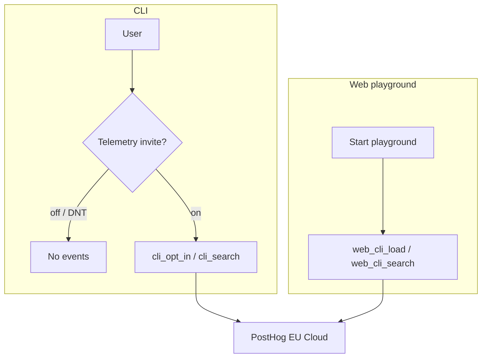

# OBSERVE

**Summary:** Cookieless PostHog analytics for CLI (opt-in) and the web playground (on after Start). Feeds **EVOLVE**; does not change SEARCH results today.



## CLI

- Default **off**. Soft invite on first interactive search.
- Enable: `git-grasp telemetry on`. Hard off: `DO_NOT_TRACK=1` or `GIT_GRASP_TELEMETRY=0` — refuses enable/persist and no-ops sends.
- Explicit `telemetry off` dismisses the soft invite (won’t re-prompt).
- Events: `cli_opt_in`, `cli_search`.
- Event fields include `app_version`, `catalog_version`, `schema_version`, `os`, opaque **`session_id`**, plus search payload (query text when opted in — do not put secrets in queries).
- **Send-time scrub:** queries matching PII/junk patterns (`piiOrJunkReason`) are dropped before PostHog send (CLI + playground).
- **`--json`:** search JSON mode never invites or tracks (silent for automation; document for operators who expect opt-in analytics).
- **`session_id`:** minted when telemetry is enabled (invite or `telemetry on`), stored in user config, sent on CLI events, cleared on `telemetry off`, new id on next enable. Used by EVOLVE THREAD.
- **Endpoint (send):** baked PostHog EU ingest host (`common/src/lib/telemetry/defaults.ts`). Override with `GIT_GRASP_POSTHOG_HOST` / `GIT_GRASP_POSTHOG_KEY` (empty key disables send).

## Web playground

- **On after Start** (consent). In-terminal notice uses `MSG.telemetry.on` ([apps/cli/README.md#ux](../apps/cli/README.md#ux)).
- Withdrawal: leave the playground / use the CLI with telemetry left off (default). No mid-session opt-out.
- Events: `web_cli_load`, `web_cli_search` (include `schema_version` / `catalog_version` when the catalog is open). THREAD uses `session_id` or PostHog cookieless `distinct_id`.
- Playground how-to: [apps/web/README.md](../apps/web/README.md). Privacy: site `/privacy` §5.

## Capture vs query host

OBSERVE **send** posts to the ingest host (`eu.i.posthog.com`). EVOLVE **pull** queries the app API (`eu.posthog.com`) with a personal API key + project id. Do not assume send and pull share a host. Operator flags: [`apps/pipeline/src/README.md`](../apps/pipeline/src/README.md). Feeder decisions: [ARCHITECTURE.md](ARCHITECTURE.md#evolve).

## Local Docker e2e

Telemetry and EVOLVE e2e target a local PostHog stack on `http://127.0.0.1:8010` (`apps/web/docker-compose.posthog.yml`), not Cloud. First boot runs migrations (~minutes, ~4GB RAM). Tests skip if the proxy is down.

```bash
docker compose -f apps/web/docker-compose.posthog.yml --profile e2e up -d
bun run evolve:seed-posthog
bun run test:telemetry-e2e
bun run test:evolve-e2e
```

Self-host uses the same host for send and pull. Seed prints `GIT_GRASP_POSTHOG_*` exports (project key, project id, personal API key).

## Code

| Path | Role |
|------|------|
| `common/src/observe/` | Stage facade |
| `common/src/lib/telemetry/` | Gate, invite, scrub, PostHog send, session id |
| `common/src/ux/messages.ts` | Shared telemetry / skill / init copy |
| `apps/cli` | `telemetry on\|off\|status` — full CLI reference: [apps/cli/README.md](../apps/cli/README.md) |
| `apps/web` | Snippet + playground events |

## Run

```bash
git-grasp telemetry status
git-grasp telemetry on
```

Downstream EVOLVE: [ARCHITECTURE.md](ARCHITECTURE.md#evolve), [`apps/pipeline/src/README.md`](../apps/pipeline/src/README.md).
