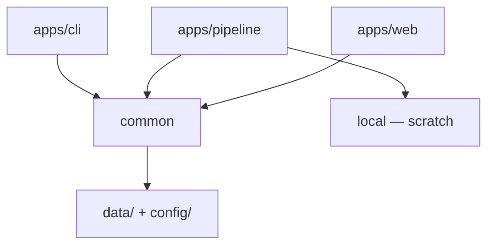
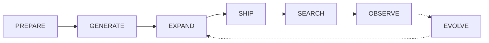

# Architecture

Schema v9: description KNN + FTS5 → fixed-blend fusion → confidence-gated display; **no search-time LLM**. Code on `feature/*`; catalog/DB on `improve/*` after held-out + regression green. Web playground: `web-catalog.db` (sql.js) + Transformers.js BGE-small.

Lifecycle index: [pipeline.md](pipeline.md).

## Packages

| Path | Package | Role |
|------|---------|------|
| [`common/`](../common/) | `@git-grasp/common` | Schema v9, embeddings, hybrid search, seed, build libraries, prompts, taxonomy, OBSERVE/EVOLVE libs |
| [`apps/cli/`](../apps/cli/) | `@git-grasp/cli` | Interactive search UX + doctor / telemetry |
| [`apps/pipeline/`](../apps/pipeline/) | `@git-grasp/pipeline` | PREPARE / GENERATE / EXPAND / SHIP / EVOLVE / eval |
| [`apps/web/`](../apps/web/) | `@git-grasp/web` | Astro site + playground |

## Data layout

| Path | Contents | Tracked? |
|------|----------|----------|
| `common/data/catalog/` | `recipes.json`, versioned `versions/recipes.vN.json` | yes (improve gate) |
| `common/data/eval/` | Regression set + reports | yes |
| `common/data/git-commands.db` | Seeded schema-v9 DB (+ `.sha256`) | yes (improve gate) |
| `common/config/thresholds.json` | Search/display thresholds | yes |
| `common/taxonomy/` | `git_commands.json`, `goal_taxonomy.json`, `flag_denylist.json` | yes |
| `local/cache/` | Build staging | no |
| `local/eval/` | Taxonomy / improve reports | no |
| `local/evolve/` | OBSERVE pull scratch / feeder | no |

## Search path

Description KNN (`sqlite-vec` / JS KNN on web) + recipe FTS5 BM25 → fixed α/β fusion (default 0.55/0.45) → soft verb boost → confidence-gated display (1–3) with **title + description**. No search-time LLM. `SEARCH_ALGORITHM_VERSION` = **3**, `SCHEMA_VERSION` = **9**. Details: [search.md](search.md).

## Tests

- `test/unit` — Vitest
- `test/integration` — Bun test
- `test/performance` — latency harnesses

See also [layout.md](layout.md), [maintainer.md](maintainer.md), [git-flow.md](git-flow.md).
