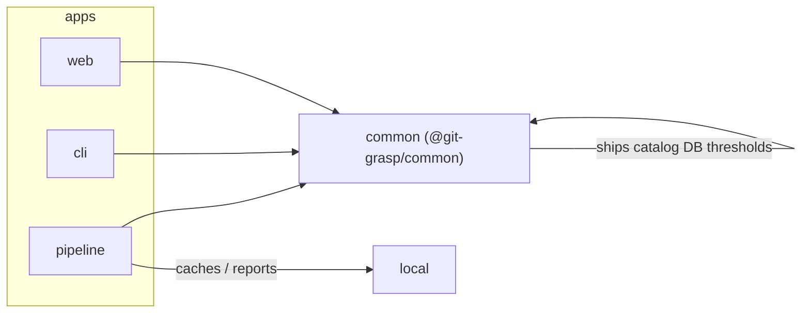

# Architecture

## Packages

| Path | Package | Role |
|------|---------|------|
| [`common/`](../common/) | `@git-grasp/common` | DB schema, embeddings, hybrid search, seed, build/eval libraries, prompts, taxonomy, **shipped** `data/` + `config/` |
| [`apps/cli/`](../apps/cli/) | `@git-grasp/cli` | Interactive search UX |
| [`apps/pipeline/`](../apps/pipeline/) | `@git-grasp/pipeline` | Batch catalog build + seed + golden/eval loop CLIs |
| [`apps/web/`](../apps/web/) | `@git-grasp/web` | Astro site + playground |

## Data layout

| Path | Contents | Tracked? |
|------|----------|----------|
| `common/data/catalog/` | `commands.json`, `intents.jsonl`, docs mirror, glossary | yes (improve gate) |
| `common/data/eval/` | Build banks + golden cases + judge criteria | yes |
| `common/data/git-commands.db` | Seeded schema-v6 DB | yes (improve gate) |
| `common/config/thresholds.json` | Search/display thresholds | yes |
| `local/cache/` | Sources, prepare, build staging | no |
| `local/eval/` | Eval reports / checkpoints | no |
| `local/bench/` | Perf binaries + result JSON | no |

Root detection (`GIT_GRASP_ROOT` / `common/src/lib/paths.ts`) fingerprints `common/data/` + `common/config/thresholds.json`.

## Search path

Intent KNN (`sqlite-vec`) + command FTS5 BM25 → weighted fusion → confidence-gated display. Shared implementation in `@git-grasp/common`; CLI and web are thin clients.

## Tests

- `test/unit` — Vitest
- `test/integration` — Bun test
- `test/performance` — latency / install harnesses (`bun run bench`)
