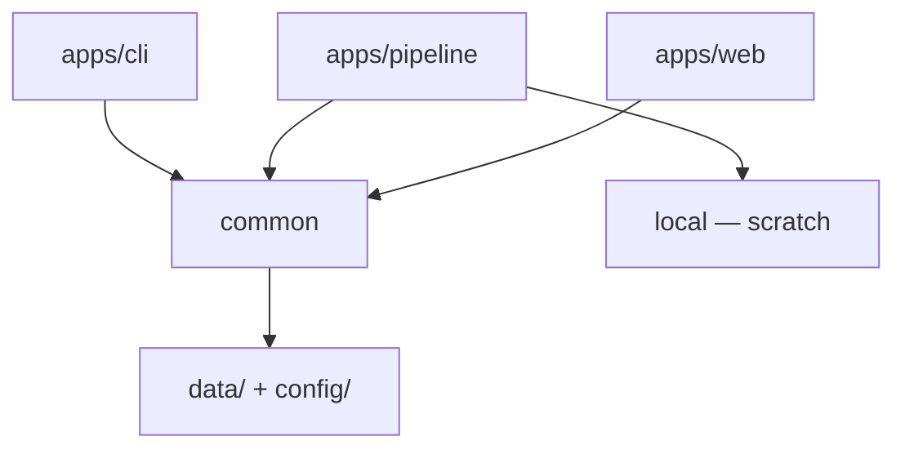
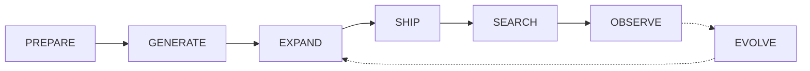

# Architecture

Schema v9: description KNN + FTS5 → fixed-blend fusion → confidence-gated display; **no search-time LLM**. Code on `feature/*`; catalog/DB on `improve/*` after held-out + regression green. Web playground: `web-catalog.db` (sql.js) + Transformers.js BGE-small.

Operator runbook: [`apps/pipeline/src/README.md`](../apps/pipeline/src/README.md). Site/playground how-to: [`apps/web/README.md`](../apps/web/README.md). Product search: [search.md](search.md). Telemetry: [observe.md](observe.md). Branch policy: [git-flow.md](git-flow.md).

## Packages

| Path | Package | Role |
|------|---------|------|
| [`common/`](../common/) | `@git-grasp/common` | Schema v9, embeddings, hybrid search, seed, build libraries, prompts, taxonomy, OBSERVE/EVOLVE libs |
| [`apps/cli/`](../apps/cli/) | `@git-grasp/cli` | Interactive search UX + doctor / telemetry |
| [`apps/pipeline/`](../apps/pipeline/) | `@git-grasp/pipeline` | Anvil catalog script — `src/{index.ts,commons,steps,tests,README.md}` plus eval/evolve one-offs |
| [`apps/web/`](../apps/web/) | `@git-grasp/web` | Astro site + playground |

| Path | Purpose |
|------|---------|
| `common/src/{prepare,generate,expand,ship,observe,evolve}/` | Stage facades |
| `common/src/build/` | Scrape, taxonomy, leaf pipeline, triage, corpus |
| `common/src/search/` | Hybrid retrieval |
| `common/prompts/` | LLM prompts: `taxonomy/`, `build/`, `improve/`, `evolve/` |
| `common/taxonomy/` | `git_commands.json`, `goal_taxonomy.json`, `flag_denylist.json` |
| `docs/` | Philosophy and architectural decisions (`docs/evolve/latest.md` is generated stats) |
| `test/{unit,integration,performance}` | Tests |
| `local/` | Gitignored scratch — do not put caches under `common/data/` |
| `common/scripts/` | Hooks (`postinstall`, `ci-audit`, `warm-model`) |
| `.github/` | CI workflows |

## Data layout

| Path | Contents | Tracked? |
|------|----------|----------|
| `common/data/catalog/` | `recipes.json`, versioned `versions/recipes.vN.json` | yes (improve gate) |
| `common/data/eval/` | Regression set + reports | yes |
| `common/data/git-commands.db` | Seeded schema-v9 DB (+ `.sha256`) | yes (improve gate) |
| `common/config/thresholds.json` | Search/display thresholds | yes |
| `common/taxonomy/` | `git_commands.json`, `goal_taxonomy.json`, `flag_denylist.json` | yes |
| `local/cache/` | Build staging | no |
| `local/eval/` | Taxonomy / improve reports | no |
| `local/evolve/` | OBSERVE pull scratch / feeder | no |

## Recipe model

Each recipe: `id`, `commands[]`, `title`, `description`, `tags`, `taxonomy_leaf`, `paraphrases[]`, provenance, validation metadata.

**Embed `description` (+ paraphrases after triage aliases).** Search never embeds raw commands.

Leaves and candidates run concurrently (`LEAF_CONCURRENCY`, `CANDIDATE_CONCURRENCY`). Corpus version / SHIP is the serial choke point.

## Catalog decisions

Operator numbers and flags: [`apps/pipeline/src/README.md`](../apps/pipeline/src/README.md).

### PREPARE

Live `git help -a` → closed `git_commands.json`, then an LLM **goal taxonomy** whose leaves map to those commands. Infrastructure for GENERATE — not the product catalog. Normal path is scrape + goals only (no cheatsheet / Pro Git / tldr ingest).

- Leaf `mapped_commands` hard-capped at 6 after normalize; hygiene fails if over.
- Reflection merges union dropped leaf commands onto `keep_id`.
- Scrape strips absolute `probe_detail` paths from the committed artifact; full probe stays under `local/prepare/`.
- Leaves that cannot map to available commands are discarded or backfilled via cover-unmapped.
- `fresh:false` refuses overwrite when `goal_taxonomy.json` exists; `fresh:true` overwrites.

### GENERATE

Per-leaf LLM draft → validate → saturate until the discovery curve flattens.

- Validation order: cheap structure → LLM plausibility → `git -h` flag allowlist → sandbox on structured fixtures → meaningfulness + back-translation. Failed candidates are rejected; the next discovery batch tries again (**no in-place regen** on the product leaf path).
- Saturate: distinct-new rate flat for N consecutive batches **after** at least one accept. All-reject batches do not count as flat checkpoints.
- Identity: structural argv fingerprint (literals and `<placeholders>` collapse); near-dup descriptions dropped.
- Ground success requires checkpoint coverage across leaves (default ≥90%) and a bounded error rate (default ≤10%), not merely “any leaf has recipes.”

### EXPAND

Circular loop: **TEST → CLASSIFY → (density | width | depth) → FILL THE GAP → TEST**.

| Bucket / axis | Meaning | Action |
|---------------|---------|--------|
| RETRIEVAL DENSITY | Recipe exists; search missed | Alias query onto recipe(s); FTS + re-embed |
| TAXONOMY DEPTH | Leaf too thin | Neighborhood paraphrases + re-GENERATE leaf + re-held-out |
| TAXONOMY WIDTH | No leaf covers intent | Gap pool → cluster (≥3) → scoped proposals (**advisory** this release) |

Gate metric is **Hit@10** (display ∪ top-10), not SEARCH Hit@display alone. Thin LLM drafts do not count. Miss triage must **not** invent `expectedId` / `correctExists` for unknown recipes (avoids false density aliases). Last-ditch broadcast (“append miss to every leaf recipe”) is off unless `--force-broadcast`.

### SHIP

Freeze a green catalog into versioned `recipes.vN.json`, mirror `recipes.json`, seed `common/data/git-commands.db`. Corpus `vN` is written when EXPAND gates pass, not in the seed step. Prefer re-seed for release artifacts over `promoteStagingDb` (promote must still write checksum). Writable opens refuse schema wipe unless `GIT_GRASP_FORCE_MIGRATE=1`.

### EVOLVE

Pull opted-in OBSERVE events, denoise, rebuild search journeys, emit an EXPAND **feeder**. Not the same as recipe **mutation** helpers (`evolveGuards` / `evolve-flag|state|composition` prompts) used inside GENERATE/EXPAND.

- **PULL** cursor advances **only after** a durable feeder/stats write (`last_event_id` for boundary dedupe).
- **FILTER** keeps `cli_search` / `web_cli_search`; one `catalog_version` per run.
- **THREAD** groups by CLI `session_id` or PostHog cookieless `distinct_id`.
- **Feeder:** miss-like journeys only (`source: 'observe'`, `correctExists: false` when no expected id). **80/20** hash split: train → chain, holdout → post-chain hit-rate stat.
- `--llm-label` is the only way to LLM-confirm weak/abandon labels.

Send vs pull hosts: [observe.md](observe.md). Stats snapshot: [evolve/latest.md](evolve/latest.md).

## Search path

Description KNN (`sqlite-vec` / JS KNN on web) + recipe FTS5 BM25 → fixed α/β fusion (default 0.55/0.45) → soft verb boost → confidence-gated display (1–3) with **title + description**. No search-time LLM. `SEARCH_ALGORITHM_VERSION` = **3**, `SCHEMA_VERSION` = **9**. Details: [search.md](search.md).

## Tests

- `test/unit` — Bun test
- `test/integration` — Bun test
- `test/performance` — latency harnesses
- `apps/pipeline/src/tests/bun` — Anvil runner tests
- `apps/web/e2e` — Playwright (see [web README](../apps/web/README.md))

See also [goals.md](goals.md), [git-flow.md](git-flow.md), [ci.md](ci.md), [security.md](security.md).
