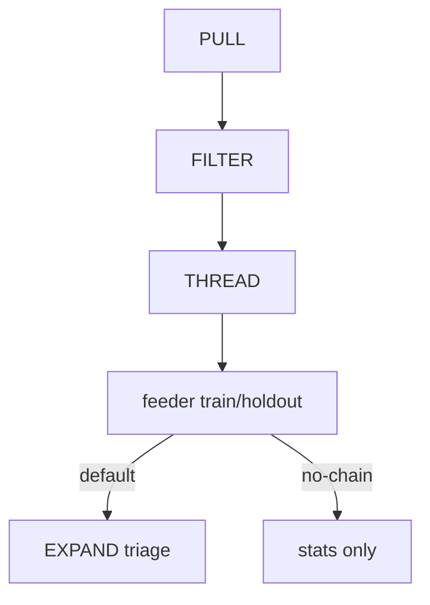

# EVOLVE

**Summary:** Pull opted-in OBSERVE events from Umami, denoise them, rebuild search journeys, and emit an EXPAND **feeder**. Default run chains into EXPAND triage/fill; use `--no-chain` to stop at the feeder.



Not the same as recipe **mutation** helpers (`evolveGuards` / `evolve-flag|state|composition` prompts) used inside GENERATE/EXPAND.

## Stages

| Step | Behavior |
|------|----------|
| **PULL** | Incremental Umami events since `local/evolve/cursor.json`. Host defaults to `http://127.0.0.1:3001`; override with `GIT_GRASP_UMAMI_*` / `.env` for prod. |
| **FILTER** | Keep `cli_search` / `web_cli_search`; drop mock, empty, burst repeats, PII/spam; one `catalog_version` per run. |
| **THREAD** | Group by CLI `session_id` or Umami session/visit/visitor; gap **45s** (soft near-edit merge to **90s**); cap length/entropy; labels `satisfied` / `weak` / `miss` / `abandon`. Optional LLM confirm for weak/abandon (`--llm-label` or `OPENAI_API_KEY`). |
| **Feeder** | Miss-like journeys only → EXPAND-compatible failure shape (`source: 'observe'`). **80/20** hash split: train → chain, holdout → post-chain hit-rate stat. |

## Artifacts

| Path | Tracked? |
|------|----------|
| `local/evolve/**` (raw, feeder, cursor, stats JSON) | No (gitignored via `local/`) |
| [`docs/evolve/latest.md`](./evolve/latest.md) | Yes — aggregate counts only |

Corpus version bump uses integer `vN` via `writeCorpusVersion` when chaining with `--ship` (or `allowVersionBump`).

## Run

```bash
# Local Umami (e2e)
docker compose -f apps/web/docker-compose.umami.yml --profile e2e up -d
bun run evolve:seed-umami
export GIT_GRASP_UMAMI_HOST=http://127.0.0.1:3001
# …website id + token from seed output

bun run evolve -- --no-chain
bun run evolve                    # feeder + EXPAND triage chain
bun run evolve -- --ship          # chain + promote when version bump allowed
bun run evolve:render-latest
```

Flags: `--no-chain`, `--llm-label`, `--ship`, `--catalog-version=N`.

## Code

| Path | Role |
|------|------|
| `apps/pipeline/src/evolve/run.ts` | CLI entry |
| `common/src/evolve/` | PULL / FILTER / THREAD / feeder / chain |
| `common/prompts/evolve/confirm-label.md` | Optional label confirm |
| `test/unit/evolve-*.test.ts` | Unit |
| `test/integration/evolve-umami.test.ts` | Docker Umami e2e |

## OBSERVE input

CLI events include opaque `session_id` (minted on telemetry enable, cleared on disable). See [observe.md](observe.md).
