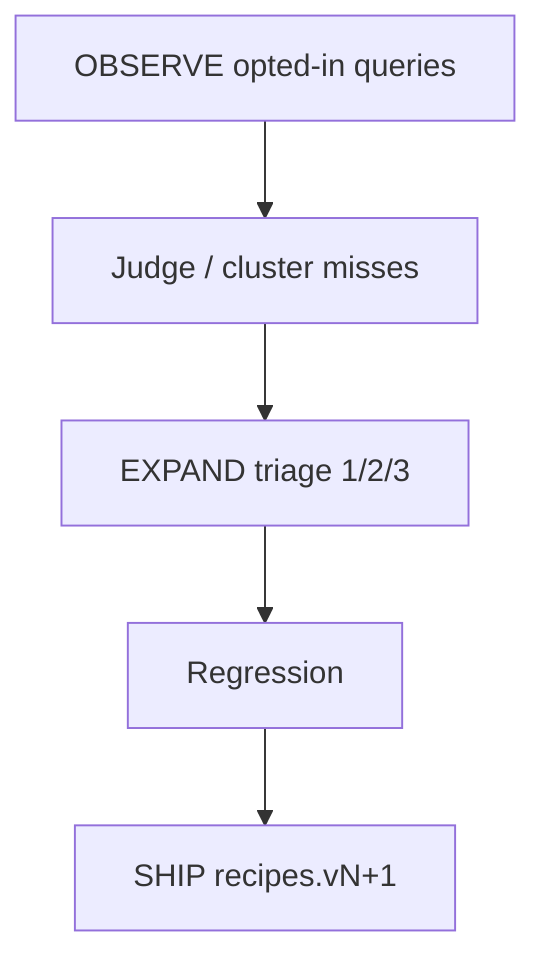

# EVOLVE

**Summary:** **Planned (not shipped).** Judge queries collected via OBSERVE and feed misses into EXPAND so the next SHIP version learns from real usage.

## Intended behavior

1. Import anonymized search events (and optional outcomes) from OBSERVE.
2. Classify misses with the same buckets as EXPAND (retrieval / leaf / taxonomy).
3. Apply EXPAND actions; keep regression green; SHIP a new corpus on `improve/*`.

## Code

| Path | Role |
|------|------|
| `common/src/evolve/` | Stub facade (`EVOLVE_STATUS = 'planned'`) |

Until this ships, use synthetic held-out inside **EXPAND** as the evolve loop.
