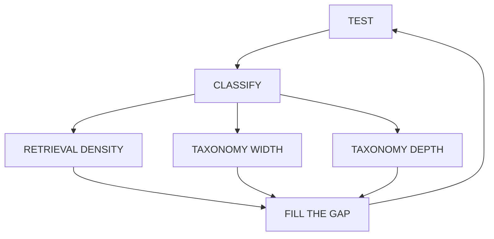

# EXPAND

**Summary:** Circular loop — **TEST → CLASSIFY → (density | width | depth) → FILL THE GAP → TEST**. Classification fans out 1∶3∶1 into a single fill step.



## Fill-the-gap axes

| Bucket / axis | Meaning | Action |
|---------------|---------|--------|
| RETRIEVAL DENSITY | Recipe exists; search missed | Alias query onto recipe(s); FTS + re-embed |
| TAXONOMY DEPTH | Leaf too thin | Neighborhood paraphrases + re-GENERATE leaf + re-held-out |
| TAXONOMY WIDTH | No leaf covers intent | Gap pool → cluster (≥3) → scoped new leaves → GENERATE |

## Code

| Path | Role |
|------|------|
| `apps/pipeline/src/expand/loop.ts` | Full loop (optional GENERATE first via `--fresh`) |
| `apps/pipeline/src/expand/holdout-retry.ts` | Retry failed leaves |
| `common/src/expand/` | Stage facade |
| `common/src/build/leafHoldout.ts` | Hit@10 gate |
| `common/src/build/improveTriage.ts` | Buckets 1/2/3 |
| `common/src/build/regressionSet.ts` | Growing regression |
| `common/prompts/improve/` | Triage / gap-cluster |

## Run

```bash
bun run expand -- --fresh          # GENERATE then EXPAND
bun run expand                     # EXPAND on existing staging
bun run expand:retry -- local/holdout-failed-leaves.txt
```

## Relation to EVOLVE

**EVOLVE** builds an observe feeder (PULL → FILTER → THREAD) and, by default, chains into the same triage/actions. See [evolve.md](evolve.md).
