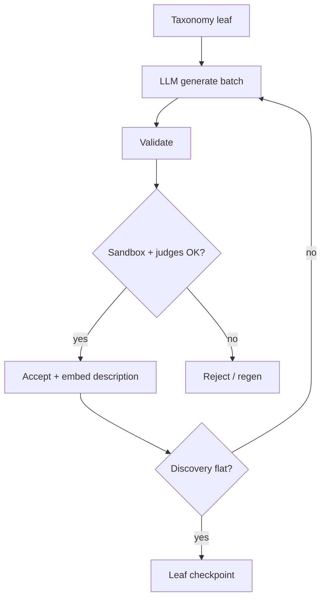

# GENERATE

**Summary:** For each taxonomy leaf, LLM-draft recipes, validate them (flags + sandbox fixtures + judges), and saturate until the discovery curve flattens. Fills the catalog **before** EXPAND.



## What it does

1. **Generate** — templated commands, title, description, fixture enum, paraphrases.
2. **Validate** — cheap structure → LLM plausibility → `git -h` flag allowlist → sandbox on structured fixtures → meaningfulness + back-translation.
3. **Saturate** — batches until distinct-new rate is flat for N consecutive batches.
4. **Identity** — structural argv fingerprint (literals and `<placeholders>` collapse); near-dup descriptions dropped.

## Code

| Path | Role |
|------|------|
| `apps/pipeline/src/generate/ground.ts` | Parallel leaf ground |
| `common/src/generate/` | Stage facade |
| `common/src/build/leafGenerate.ts` | Batch generate |
| `common/src/build/recipeValidate.ts` | Validation chain |
| `common/src/build/leafSaturate.ts` | Discovery curve |
| `common/src/build/sandbox*.ts` | Fixtures + execution |
| `common/src/build/argvNormalize.ts` | Structural fingerprint |
| `common/prompts/build/` | Generate / plausibility / judges |

## Run

```bash
bun run generate -- --fresh --max-leaves=20 --max-batches=5   # smoke
bun run generate -- --fresh                                   # all leaves
```

Staging DB: `local/cache/build/staging.db`.
