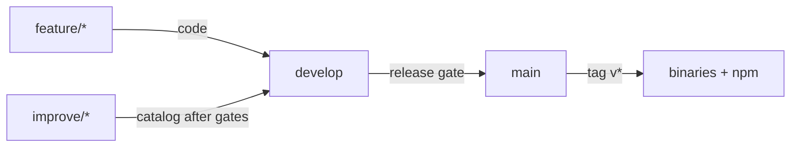

# Git flow

Use **git-flow**. Do not commit product/code changes straight to `main` or mix concerns on the wrong branch type.

| Branch | Purpose |
|--------|---------|
| `main` | Release line. Merge only after the relevant gate. |
| `develop` | Integration. Keep in sync with `main` after merges. |
| `feature/*` | **Code** changes only. |
| `improve/*` | **EXPAND / catalog** outcomes: regenerated recipes, seeded DB, reports. |
| `chore/catalog-*` | Catalog/seed maintenance when not part of an improve cycle. |
| Tags `v*` on `main` | Binaries + npm publish |

### What goes where

- **Code** → `feature/*` → `develop` → `main`.
- **Eval/catalog** → `improve/*` after held-out + regression green → `develop` → `main`.
- Never force-push `main`.

### Eval gate

Leaf held-out (**Hit@10** ≥0.95 ×2 — display hits ∪ top-10) + regression set unlock catalog merges. That is broader than SEARCH **Hit@display** (gated 1–3). EXPAND triage buckets 1/2/3 are automated.

Create/merge `improve/*` locally after held-out + regression are green — GitHub Actions does not commit catalog changes. See [ci.md](ci.md).

See also [CLAUDE.md](../CLAUDE.md), [expand.md](expand.md).
