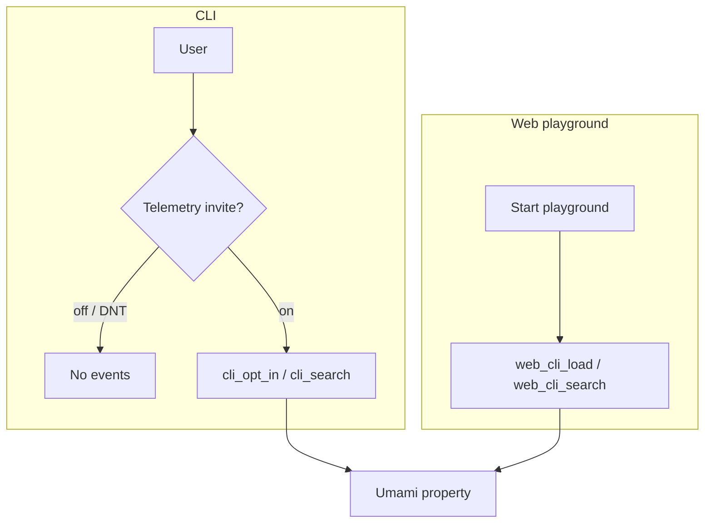

# OBSERVE

**Summary:** Cookieless Umami analytics for CLI (opt-in) and the web playground (on after Start). Feeds **EVOLVE**; does not change SEARCH results today.



## CLI

- Default **off**. Soft invite on first interactive search.
- Enable: `git-grasp telemetry on`. Hard off: `DO_NOT_TRACK=1` or `GIT_GRASP_TELEMETRY=0`.
- Events: `cli_opt_in`, `cli_search`.
- Event fields include `app_version`, `catalog_version`, `schema_version`, `os`, opaque **`session_id`**, plus search payload (query text when opted in — do not put secrets in queries).
- **`session_id`:** minted when telemetry is enabled (invite or `telemetry on`), stored in user config, sent on CLI events, cleared on `telemetry off`, new id on next enable. Used by EVOLVE THREAD.
- **Endpoint:** baked Umami Cloud host + website id (`common/src/lib/telemetry/defaults.ts`). Override with `GIT_GRASP_UMAMI_HOST` / `GIT_GRASP_UMAMI_WEBSITE_ID` (empty website id disables send).

## Web playground

- **On after Start** (consent). In-terminal notice uses `MSG.telemetry.on` ([cli-ux.md](cli-ux.md)).
- Withdrawal: leave the playground / use the CLI with telemetry left off (default). No mid-session opt-out.
- Events: `web_cli_load`, `web_cli_search` (include `schema_version` / `catalog_version` when the catalog is open). THREAD uses Umami session/visit/visitor ids.
- Details: [web.md](web.md), site `/privacy` §5.

## Code

| Path | Role |
|------|------|
| `common/src/observe/` | Stage facade |
| `common/src/lib/telemetry/` | Gate, invite, Umami send, session id |
| `common/src/ux/messages.ts` | Shared telemetry / skill / init copy |
| `apps/cli` | `telemetry on\|off\|status` — full CLI reference: [cli.md](cli.md) |
| `apps/web` | Script + playground events |

## Run

```bash
git-grasp telemetry status
git-grasp telemetry on
```

Downstream: [evolve.md](evolve.md).
