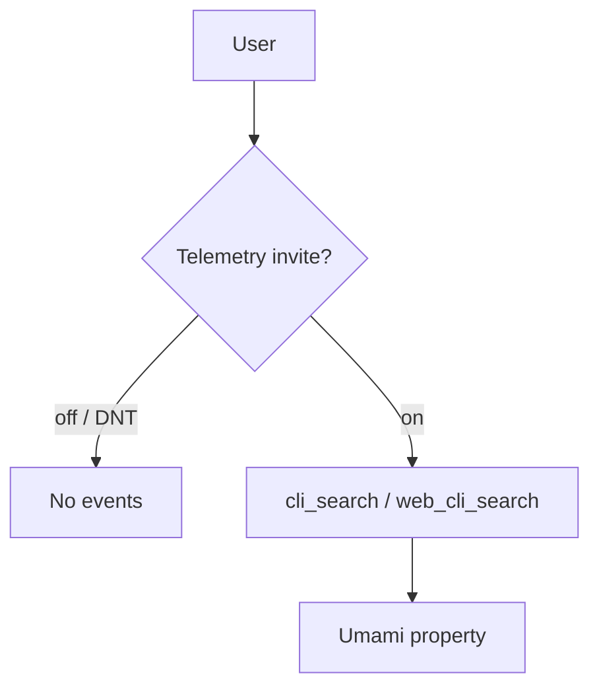

# OBSERVE

**Summary:** Optional, **opt-in** telemetry of CLI/web usage (cookieless Umami). Feeds future EVOLVE; does not change SEARCH results today.



## What it does

- Default **off**. Soft invite on first interactive CLI search.
- Hard off: `DO_NOT_TRACK=1` or `GIT_GRASP_TELEMETRY=0`.
- Events: `cli_opt_in`, `cli_search`, `web_cli_load`, `web_cli_search`.

## Code

| Path | Role |
|------|------|
| `common/src/observe/` | Stage facade |
| `common/src/lib/telemetry/` | Gate, invite, Umami send |
| `apps/cli` | `telemetry on\|off\|status` |
| `apps/web` | Script + playground events |

## Run

```bash
git-grasp telemetry status
git-grasp telemetry on
```
