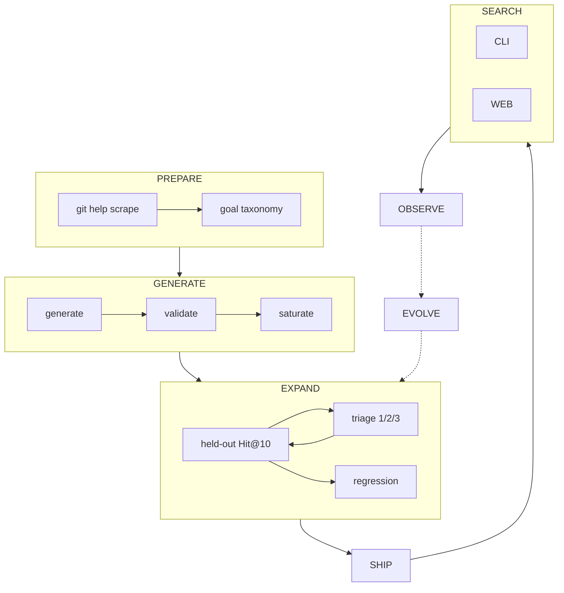

# Pipeline (index)

How git-grasp builds and ships its offline Git recipe catalog.

**Philosophy** ([CLAUDE.md](../CLAUDE.md)): models derive catalog **content** from `git help` + an LLM goal taxonomy. Code constrains (Zod, caps, sandbox). Hand-authored goldens are not the normal path.

Schema **v9**: `recipes` + `vec_recipes` (description embeddings) + `recipes_fts`.

## Stage docs

| Stage | Doc | Script |
|-------|-----|--------|
| PREPARE | [prepare.md](prepare.md) | `prepare:scrape`, `prepare:goals` |
| GENERATE | [generate.md](generate.md) | `generate` |
| EXPAND | [expand.md](expand.md) | `expand` |
| SHIP | [ship.md](ship.md) | `ship` |
| SEARCH | [search.md](search.md) | `cli` / web |
| OBSERVE | [observe.md](observe.md) | `telemetry` |
| EVOLVE | [evolve.md](evolve.md) | *(planned)* |

Apps layout: `apps/pipeline/src/{prepare,generate,expand,ship,eval}/`. Shared libs still live under `common/src/build/` with stage facades in `common/src/{prepare,…}/`.

## Recipe model (shared)

Each recipe: `id`, `commands[]`, `title`, `description`, `tags`, `taxonomy_leaf`, `paraphrases[]`, provenance, validation metadata.

**Embed `description` (+ paraphrases after triage aliases).** Search never embeds raw commands.

## Parallelism

Leaves and candidates run concurrently (`LEAF_CONCURRENCY`, `CANDIDATE_CONCURRENCY`). Corpus version / SHIP is the serial choke point.
