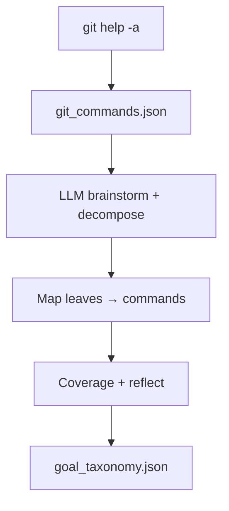

# PREPARE

**Summary:** Turn live `git help` into a closed command list, then an LLM **goal taxonomy** whose leaves map to those commands. Output is infrastructure for GENERATE — not the product catalog.

## What it does

1. **Scrape** — `bun run prepare:scrape` runs `git help -a`, probes verbs, writes `common/taxonomy/git_commands.json`.
2. **Goals** — `bun run prepare:goals` builds `common/taxonomy/goal_taxonomy.json`: brainstorm categories, recursive decompose (depth/fan-out caps), map each leaf to scraped commands, coverage checks, ≤3 reflection rounds (rename/merge only).

## Code

| Path | Role |
|------|------|
| `apps/pipeline/src/prepare/` | CLI entrypoints |
| `common/src/prepare/` | Stage facade |
| `common/src/build/taxonomyScrape.ts` | Parse/probe help |
| `common/src/build/goalTaxonomy.ts` | LLM taxonomy builder |
| `common/prompts/taxonomy/` | Brainstorm / decompose / map / reflect / cover |

## Outputs

- `common/taxonomy/git_commands.json`
- `common/taxonomy/goal_taxonomy.json` (+ coverage under `local/` when run)

## Notes

- No Pro Git / tldr in the normal path (legacy Step −1 `prepare.ts` / catalog sources were removed; use `prepare:scrape` + `prepare:goals`).
- User-facing scripts/errors use `prepare:*` (not `taxonomy:*`).
- `fresh:false` refuses overwrite when `goal_taxonomy.json` exists; `fresh:true` overwrites.
- Leaf `mapped_commands` hard-capped at 6 after normalize; hygiene fails if over.
- Reflection merges union dropped leaf commands onto `keep_id`.
- Scrape strips absolute `probe_detail` paths from the committed `git_commands.json`; full probe under `local/prepare/`.
- Leaves that cannot map to available commands are discarded or backfilled via cover-unmapped.
