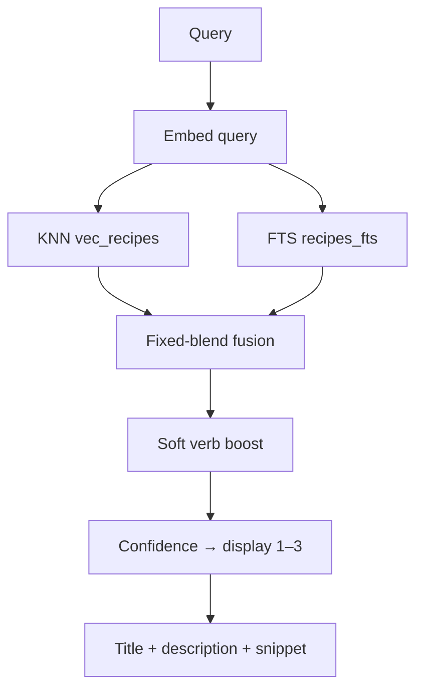

# SEARCH

**Summary:** The product. Ask in plain language — **install the CLI** or use the **web playground**. Same hybrid retrieval either way. **No LLM at query time.**

## Surfaces

| Surface | How |
|---------|-----|
| CLI | `bun add -g git-grasp` or a [release binary](../README.md#binaries-latest-github-release) — full reference [cli.md](cli.md) |
| Web | [git-grasp.cremaschi.dev](https://git-grasp.cremaschi.dev) playground — [apps/web/README.md](../apps/web/README.md) |

## What it does

1. Verify DB `.sha256` integrity, then `schema_version` (**9**) + `search_algorithm_version` (**3**) (CLI and web). Mismatch → `VERSION` (doctor tip).
2. Embed the query (local BGE-small). Recipe embed text is **description + paraphrases**.
3. Parallel description KNN (`vec_recipes`) + BM25 FTS (`recipes_fts`).
4. Fixed-blend fusion (default **α=0.55** cosine / **β=0.45** BM25). Single-channel batches collapse to 1/0 or 0/1.
5. Soft **verb boost** when the query names git verbs (reorders / lifts hybrid scores; also feeds abstain evidence).
6. Confidence-gated display 1–3 (or abstain), then diversify by **structural** command fingerprint (literal vs `<placeholder>` collapse).

## Display gate (honest)

Thresholds live in `common/config/thresholds.json` (`schemaVersion` there is the **thresholds file** version, not DB v9).

| Signal | Behavior |
|--------|----------|
| `confidenceVeryHigh` + exact gap | Show **1**, alert none |
| `confidenceHigh` + narrow gap | Show **2**, alert yellow |
| Below that / near-tie | Show up to **3**, alert orange |
| `confidenceMedium` | Present in config for compatibility — **not** used by the gate |
| Absolute abstain (red / 0) | Only when top cosine is weak **and** no BM25 **and** no verb boost |

Near-ties widen display; crowded ≠ absent. Eval “Hit@display” uses the gated set; leaf held-out also accepts top-10 (see [architecture.md](architecture.md#expand)).

## Code

| Path | Role |
|------|------|
| `apps/cli` | CLI UX |
| `apps/web` | Playground (sql.js pack) |
| `common/src/search/` | Hybrid, fusion, verb boost, embed, FTS |
| `common/src/cli-api.ts` | Shared search facade |
