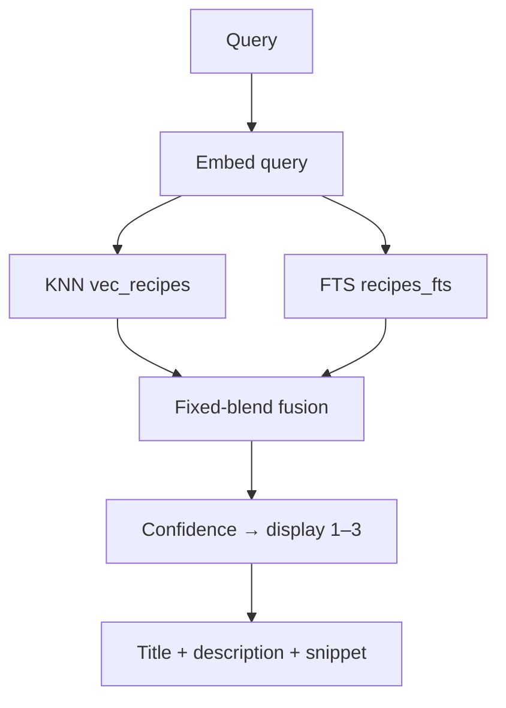

# SEARCH

**Summary:** The product. Ask in plain language — **install the CLI** or use the **web playground**. Same hybrid retrieval either way. **No LLM at query time.**



## Surfaces

| Surface | How |
|---------|-----|
| CLI | `bun add -g git-grasp` or a [release binary](../README.md#binaries-latest-github-release) — full reference [cli.md](cli.md) |
| Web | [git-grasp.cremaschi.dev](https://git-grasp.cremaschi.dev) playground — see [web.md](web.md) |

## What it does

1. Verify DB `.sha256` integrity, then `schema_version` + `search_algorithm_version` (CLI and web).
2. Embed the query (local BGE-small). Embed text for recipes is description + paraphrases.
3. Parallel description KNN (`vec_recipes`) + BM25 FTS (`recipes_fts`).
4. Fuse scores; soft verb boost; confidence-gated display 1–3 (or abstain).
5. Diversify by **structural** command fingerprint (literal vs `<placeholder>` collapse).

## Code

| Path | Role |
|------|------|
| `apps/cli` | CLI UX |
| `apps/web` | Playground (sql.js pack) |
| `common/src/search/` | Hybrid, fusion, embed, FTS |
| `common/src/cli-api.ts` | Shared search facade |

## Run

```bash
bun run cli -- "undo last commit keep files"
bun run doctor
git-grasp --json "undo last commit keep files"
```