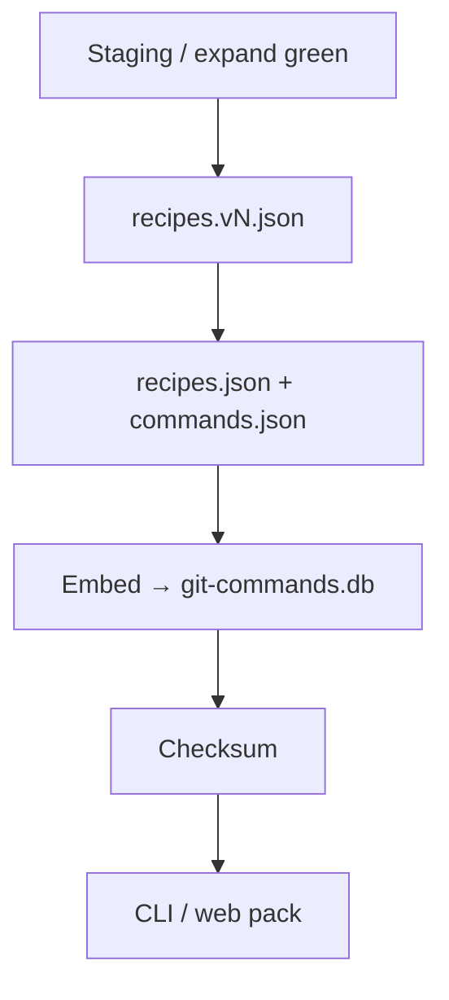

# SHIP

**Summary:** Freeze a green catalog into a versioned `recipes.vN.json`, mirror `recipes.json`, and seed `common/data/git-commands.db` so SEARCH (CLI/web) can load it.

## Checklist

1. EXPAND green (0.95×2 leaf held-out + ≥80% leaf-rate + regression).
2. Optional: `bun run ship:dedupe`.
3. Corpus version dump (`recipes.vN.json` / `recipes.latest.json`).
4. `bun run ship` — **atomic** seed to temp DB → rename → write `.sha256`.
5. `bun run web:pack` for playground.

**Promote vs seed:** `promoteStagingDb` copies staging → prod and **must** write checksum. Prefer re-seed for release artifacts. Writable opens refuse schema wipe unless `GIT_GRASP_FORCE_MIGRATE=1`.

## What it does

1. **Corpus version** — after EXPAND regression green, write `common/data/catalog/versions/recipes.vN.json` + latest pointer.
2. **Dedupe (optional)** — `bun run ship:dedupe` merges structural argv twins offline (no LLM).
3. **Seed** — `bun run ship` embeds description (+ paraphrases) into schema v9 DB + `.sha256`.

## Code

| Path | Role |
|------|------|
| `apps/pipeline/src/steps/ship.ts` | Seed step |
| `apps/pipeline/src/steps/shipDedupe.ts` | Offline merge |
| `common/src/ship/` | Stage facade |
| `common/src/seed.ts` | Embed + write DB |
| `common/src/build/corpusVersion.ts` | Version writer |
| `common/src/build/mergeRecipes.ts` | Structural merge |

## Run

See [`apps/pipeline/src/README.md`](../apps/pipeline/src/README.md). Shims: `bun run ship`, `bun run ship:dedupe`. `bun run web:pack` stays a web script after seed.
